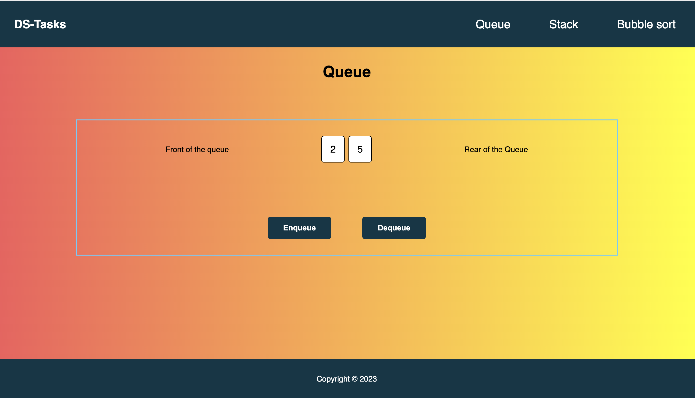

# Application explaining about different data structures

This application explains the behaviour of different data structures like queue, stack etc.

It can be accessed at https://genuine-sfogliatella-8011b1.netlify.app/



## How to run the app locally

run below commands and navigate to http://localhost:3000

```bash
npm install
npm start
```

## Details

This application talks about 3 different data structures tasks

### 1. Queue

Navigate to http://localhost:3000/queue to see how queue data structure works. It is basically works on FIFO (first in first out) manner.

### 2. Stack

Navigate to http://localhost:3000/stack to see how stack data structure works. It is basically works on LIFO (Last in first out) manner.

### 3. Bubble sort

Navigate to http://localhost:3000/bubblesort to see how bubble sort works. Enter comma seperated numbers (positive/negative) and click sort button.

Worst case complexity of this algorithm is O(n^2)
